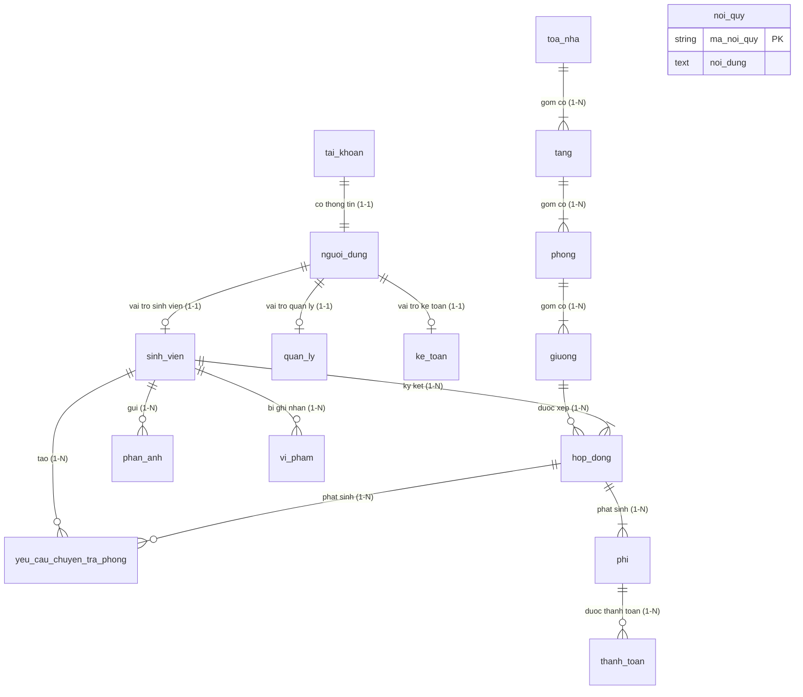

# Tài liệu Thiết Kế Cơ Sở Dữ Liệu - Hệ Thống Quản Lý Ký Túc Xá (KTX)

## 1. Giới thiệu tổng quan
Hệ thống Quản lý Ký túc xá (KTX) được thiết kế theo chuẩn quan hệ 3NF (Third Normal Form) nhằm đảm bảo toàn vẹn dữ liệu, loại bỏ dư thừa và tối ưu hóa cho các thao tác nghiệp vụ, tài chính, báo cáo cũng như tích hợp các mô hình AI (RAG Hỏi - Đáp nội quy, Tự động phân loại & Tóm tắt sự cố phản ánh).

Hệ thống sử dụng **SQLAlchemy 2.0** với cú pháp Declarative Base (`Mapped`, `mapped_column`, `relationship`).

---

## 2. Sơ đồ Quan hệ Thực thể (ERD - Mermaid)

---

## 3. Danh mục Chi tiết các Bảng và Thuộc tính

### 3.1. Phân hệ Tài khoản & Người dùng (`app/models/user.py`)

#### 1. Bảng `tai_khoan`
- **Mục đích**: Xác thực đăng nhập và lưu trữ thông tin ủy quyền hệ thống.
- **Các trường**:
  - `ma_tai_khoan` (VARCHAR(36), PK): Mã định danh duy nhất (UUID string).
  - `ten_dang_nhap` (VARCHAR(50), NOT NULL, UNIQUE, INDEX): Tên tài khoản đăng nhập.
  - `mat_khau` (VARCHAR(255), NOT NULL): Mật khẩu băm (bcrypt).
  - `vai_tro` (ENUM('QuanLy', 'SinhVien', 'KeToan'), NOT NULL): Vai trò hệ thống.
- **Quan hệ**: 1-1 với `nguoi_dung` (`back_populates="tai_khoan"`, cascade delete).

#### 2. Bảng `nguoi_dung`
- **Mục đích**: Lưu thông tin cá nhân cơ bản của người dùng.
- **Các trường**:
  - `ma_nguoi_dung` (VARCHAR(36), PK): UUID string.
  - `ma_tai_khoan` (VARCHAR(36), FK `tai_khoan.ma_tai_khoan`, NOT NULL, UNIQUE): Liên kết 1-1 với tài khoản, cascade delete.
  - `ho_ten` (VARCHAR(100), NOT NULL): Họ và tên đầy đủ.
  - `email` (VARCHAR(100), UNIQUE, NULLABLE): Địa chỉ email liên hệ.
  - `so_dien_thoai` (VARCHAR(15), NULLABLE): Số điện thoại liên hệ.
- **Quan hệ**:
  - 1-1 với `tai_khoan`.
  - 1-1 với `sinh_vien`, `quan_ly`, `ke_toan` (chuyên biệt hóa vai trò).

#### 3. Bảng `sinh_vien`
- **Mục đích**: Thông tin chi tiết dành riêng cho sinh viên nội trú.
- **Các trường**:
  - `msv` (VARCHAR(20), PK, INDEX): Mã số sinh viên.
  - `ma_nguoi_dung` (VARCHAR(36), FK `nguoi_dung.ma_nguoi_dung`, NOT NULL, UNIQUE): Khóa ngoại liên kết `nguoi_dung`.
  - `lop` (VARCHAR(50), NOT NULL): Lớp sinh hoạt / chuyên ngành.
  - `gioi_tinh` (VARCHAR(10), NOT NULL): Giới tính ("Nam", "Nu").
- **Quan hệ**:
  - 1-1 với `nguoi_dung`.
  - 1-N với `hop_dong`, `yeu_cau_chuyen_tra_phong`, `phan_anh`, `vi_pham`.

#### 4. Bảng `quan_ly`
- **Mục đích**: Thông tin ban quản lý KTX.
- **Các trường**:
  - `ma_quan_ly` (VARCHAR(20), PK): Mã quản lý.
  - `ma_nguoi_dung` (VARCHAR(36), FK `nguoi_dung.ma_nguoi_dung`, NOT NULL, UNIQUE).
- **Quan hệ**: 1-1 với `nguoi_dung`.

#### 5. Bảng `ke_toan`
- **Mục đích**: Thông tin nhân sự phòng kế toán / tài chính KTX.
- **Các trường**:
  - `ma_ke_toan` (VARCHAR(20), PK): Mã kế toán.
  - `ma_nguoi_dung` (VARCHAR(36), FK `nguoi_dung.ma_nguoi_dung`, NOT NULL, UNIQUE).
- **Quan hệ**: 1-1 với `nguoi_dung`.

---

### 3.2. Phân hệ Cơ sở vật chất Ký túc xá (`app/models/dorm.py`)

#### 6. Bảng `toa_nha`
- **Mục đích**: Quản lý các block/tòa nhà KTX.
- **Các trường**:
  - `ma_toa` (VARCHAR(20), PK): Mã tòa nhà (VD: "A1", "B2").
  - `ten_toa` (VARCHAR(50), NOT NULL, UNIQUE): Tên tòa nhà hiển thị.
- **Quan hệ**: 1-N với `tang` (Cascade Delete).

#### 7. Bảng `tang`
- **Mục đích**: Quản lý các tầng trong từng tòa nhà.
- **Các trường**:
  - `ma_tang` (VARCHAR(20), PK): Mã tầng (VD: "A1_T1").
  - `so_tang` (INT, NOT NULL): Thứ tự số tầng (1, 2, 3...).
  - `ma_toa` (VARCHAR(20), FK `toa_nha.ma_toa`, NOT NULL): Thuộc tòa nhà nào.
- **Quan hệ**: N-1 với `toa_nha`, 1-N với `phong` (Cascade Delete).

#### 8. Bảng `phong`
- **Mục đích**: Quản lý phòng lưu trú trong từng tầng.
- **Các trường**:
  - `ma_phong` (VARCHAR(20), PK): Mã phòng (VD: "P101").
  - `so_phong` (VARCHAR(20), NOT NULL): Số hiệu phòng ("101").
  - `suc_chua` (INT, NOT NULL, DEFAULT 4): Số lượng giường/sinh viên tối đa.
  - `loai_phong` (VARCHAR(50), NOT NULL): Phân loại phòng ("Phong 4 nguoi", "Phong 6 nguoi").
  - `ma_tang` (VARCHAR(20), FK `tang.ma_tang`, NOT NULL): Thuộc tầng nào.
- **Quan hệ**: N-1 với `tang`, 1-N với `giuong` (Cascade Delete).

#### 9. Bảng `giuong`
- **Mục đích**: Quản lý vị trí giường đơn lẻ trong phòng.
- **Các trường**:
  - `ma_giuong` (VARCHAR(20), PK): Mã giường (VD: "G101_1").
  - `trang_thai` (VARCHAR(20), NOT NULL, DEFAULT 'TRONG', INDEX): Trạng thái ("TRONG", "DA_CO_NGUOI").
  - `ma_phong` (VARCHAR(20), FK `phong.ma_phong`, NOT NULL): Thuộc phòng nào.
- **Quan hệ**: N-1 với `phong`, 1-N với `hop_dong`.

---

### 3.3. Phân hệ Nghiệp vụ Ở, Hợp đồng & Tài chính (`app/models/contract.py`)

#### 10. Bảng `hop_dong`
- **Mục đích**: Hợp đồng thuê giường nội trú của sinh viên.
- **Các trường**:
  - `ma_hop_dong` (VARCHAR(20), PK): Số hợp đồng.
  - `msv` (VARCHAR(20), FK `sinh_vien.msv`, NOT NULL, INDEX): Sinh viên ký hợp đồng.
  - `ma_giuong` (VARCHAR(20), FK `giuong.ma_giuong`, NOT NULL, INDEX): Giường được phân bổ.
  - `ngay_bat_dau` (DATE, NOT NULL): Ngày bắt đầu hiệu lực.
  - `ngay_ket_thuc` (DATE, NULLABLE): Ngày hết hạn (nếu có).
  - `trang_thai` (VARCHAR(20), NOT NULL, DEFAULT 'ACTIVE', INDEX): Trạng thái ("ACTIVE", "EXPIRED", "TERMINATED").
- **Quan hệ**:
  - N-1 với `sinh_vien` và `giuong`.
  - 1-N với `yeu_cau_chuyen_tra_phong`, `phi` (Cascade Delete).

#### 11. Bảng `yeu_cau_chuyen_tra_phong`
- **Mục đích**: Tiếp nhận và phê duyệt yêu cầu chuyển phòng, trả phòng từ sinh viên.
- **Các trường**:
  - `ma_yeu_cau` (VARCHAR(20), PK): Mã phiếu yêu cầu.
  - `msv` (VARCHAR(20), FK `sinh_vien.msv`, NOT NULL, INDEX).
  - `ma_hop_dong` (VARCHAR(20), FK `hop_dong.ma_hop_dong`, NOT NULL, INDEX).
  - `loai_yeu_cau` (VARCHAR(50), NOT NULL): "CHUYEN_PHONG" hoặc "TRA_PHONG".
  - `trang_thai` (VARCHAR(20), NOT NULL, DEFAULT 'CHO_DUYET', INDEX): "CHO_DUYET", "DA_DUYET", "TU_CHOI".
- **Quan hệ**: N-1 với `sinh_vien` và `hop_dong`.

#### 12. Bảng `phi`
- **Mục đích**: Các khoản chi phí phát sinh theo hợp đồng (tiền phòng, tiền điện, tiền nước).
- **Các trường**:
  - `ma_phi` (VARCHAR(20), PK): Mã khoản thu.
  - `ma_hop_dong` (VARCHAR(20), FK `hop_dong.ma_hop_dong`, NOT NULL, INDEX): Hợp đồng chịu phí.
  - `loai_phi` (VARCHAR(50), NOT NULL): "TIEN_PHONG", "TIEN_DIEN", "TIEN_NUOC".
  - `so_tien` (FLOAT, NOT NULL): Định mức tiền cần nộp.
  - `han_nop` (DATE, NOT NULL): Hạn chót đóng tiền.
- **Quan hệ**: N-1 với `hop_dong`, 1-N với `thanh_toan` (Cascade Delete).

#### 13. Bảng `thanh_toan`
- **Mục đích**: Ghi nhận các giao dịch thanh toán chi phí.
- **Các trường**:
  - `ma_thanh_toan` (VARCHAR(20), PK): Mã giao dịch thanh toán.
  - `ma_phi` (VARCHAR(20), FK `phi.ma_phi`, NOT NULL, INDEX): Khoản phí được chi trả.
  - `so_tien_da_dong` (FLOAT, NOT NULL): Số tiền thực đóng.
  - `ngay_thanh_toan` (DATE, NOT NULL): Ngày giao dịch hoàn tất.
- **Quan hệ**: N-1 với `phi`.

---

### 3.4. Phân hệ Phản ánh, Vi phạm & Tri thức AI (`app/models/incident.py`)

#### 14. Bảng `phan_anh`
- **Mục đích**: Lưu trữ các phản ánh, khiếu nại, báo hỏng cơ sở vật chất từ sinh viên, tích hợp AI tự động xử lý.
- **Các trường**:
  - `ma_phan_anh` (VARCHAR(20), PK): Mã phản ánh.
  - `msv` (VARCHAR(20), FK `sinh_vien.msv`, NOT NULL, INDEX): Sinh viên gửi phản ánh.
  - `noi_dung` (TEXT, NOT NULL): Chi tiết sự cố do sinh viên mô tả.
  - `trang_thai` (VARCHAR(20), NOT NULL, DEFAULT 'TIEP_NHAN', INDEX): "TIEP_NHAN", "DANG_XU_LY", "HOAN_THANH".
  - `ngay_gui` (DATE, NOT NULL): Ngày gửi.
  - `phan_loai` (VARCHAR(50), NULLABLE): Nhãn sự cố do AI tự động phân loại (VD: "Dien", "Nuoc", "VeSinh", "AnNinh").
  - `tom_tat` (TEXT, NULLABLE): Tóm tắt sự cố do AI trích xuất để quản lý nhanh chóng nắm bắt.
- **Quan hệ**: N-1 với `sinh_vien`.

#### 15. Bảng `vi_pham`
- **Mục đích**: Ghi nhận biên bản vi phạm kỷ luật của sinh viên nội trú.
- **Các trường**:
  - `ma_vi_pham` (VARCHAR(20), PK): Mã biên bản vi phạm.
  - `msv` (VARCHAR(20), FK `sinh_vien.msv`, NOT NULL, INDEX): Sinh viên vi phạm.
  - `mo_ta` (TEXT, NOT NULL): Nội dung hành vi vi phạm.
  - `ngay_vi_pham` (DATE, NOT NULL): Ngày xảy ra vi phạm.
  - `hinh_thuc_xu_ly` (VARCHAR(100), NOT NULL): Biện pháp xử lý (VD: "Nhac nho", "Canh cao", "Truoc quyen o").
- **Quan hệ**: N-1 với `sinh_vien`.

#### 16. Bảng `noi_quy`
- **Mục đích**: Cơ sở dữ liệu tri thức nội quy KTX làm nguồn dữ liệu (Knowledge Base) phục vụ kỹ thuật RAG (Retrieval-Augmented Generation) cho Chatbot hỗ trợ sinh viên 24/7.
- **Các trường**:
  - `ma_noi_quy` (VARCHAR(20), PK): Mã điều khoản nội quy.
  - `noi_dung` (TEXT, NOT NULL): Văn bản quy định, nội quy lưu trú.

---

## 4. Tích hợp AI và Tối ưu hóa Truy vấn

1. **RAG (Retrieval-Augmented Generation) cho Chatbot**:
   - Bảng `noi_quy` đóng vai trò là kho văn bản gốc. Dịch vụ AI (`ChatbotService`) sẽ chunking và embedding nội dung các điều khoản để phục vụ tìm kiếm ngữ nghĩa (semantic search) trả lời tức thì thắc mắc của sinh viên.
2. **AI Classification & Summarization**:
   - Bảng `phan_anh` lưu trữ trực tiếp nhãn `phan_loai` và đoạn `tom_tat` từ `AIService`, giúp cán bộ kỹ thuật lọc sự cố theo chuyên môn (Điện, Nước, Vệ sinh) mà không cần duyệt toàn văn bản thô dài.
3. **Đánh chỉ mục (Indexing)**:
   - Tất cả các trường thường dùng trong điều kiện tìm kiếm, lọc và JOIN (`ten_dang_nhap`, `msv`, `ma_giuong`, `ma_hop_dong`, `ma_phi`, `trang_thai`) đều được gắn `index=True` để tăng tốc độ truy vấn tối đa.
